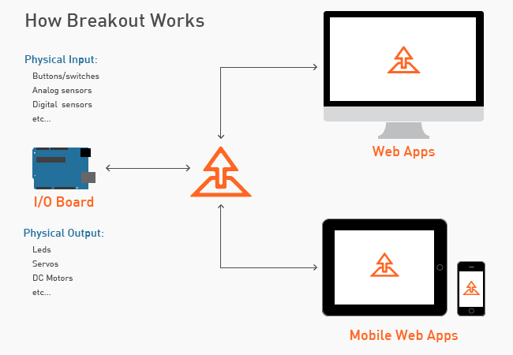

# Firmata Protocol Documentation

Firmata is a protocol for communicating with microcontrollers from software on a computer (or smartphone/tablet, etc). The protocol can be implemented in firmware on any microcontroller architecture as well as software on any computer software package (see list of client libraries below).
Firmata是与来自电脑上（或智能手机/平板电脑等）的软件的微控制器进行通信的协议。该协议可以在任何微控制器架构的固件以及任何计算机软件的软件包来实现（见客户端库的名单如下）。

Firmata is based on the [midi message format](http://www.midi.org/techspecs/midimessages.php) in that commands bytes are 8 bits and data bytes are 7 bits. For example the midi Channel Pressure (Command: 0xD0) message is 2 bytes long, in Firmata the Command 0xD0 is used to enable reporting for a digital port (collection of 8 pins). Both the midi and Firmata versions are 2 bytes long, but the meaning is obviously different. In Firmata, the number of bytes in a message must conform with the corresponding midi message. Midi [System Exclusive](http://www.2writers.com/eddie/tutsysex.htm) (Sysex) messages however, can be any length and are therefore used most prominently throughout the Firmata protocol.
Firmata是基于[MIDI消息格式]（http://www.midi.org/techspecs/midimessages.php）,命令字节是8位和数据字节是7位。例如MIDI通道压力（命令：0xD0）消息是2字节长，在Firmata,命令0xD0用于启用用于数字端口（8个管脚集合）的报告。无论是MIDI和Firmata版本都是2个字节长，但含义显然是不同的。在Firmata，一消息字节的数目必须与相应的MIDI消息符合。然而，MIDI [系统专用]（http://www.2writers.com/eddie/tutsysex.htm）（SYSEX）消息，可以是任意长度，因此在Firmata协议中，MIDI消息使用的最多。

This repository contains documentation of the Firmata protocol. The core of the protocol is described in the [protocol.md file](protocol.md) file. Feature-specific documentation is described in individual markdown files ([i2c.md](i2c.md), [stepper.md](stepper.md), [servos.md](servos.md), etc). Files appended with '-proposal' are proposals for new features that have not yet been finalized.
这个库包含Firmata协议文档。协议的核心在[protocol.md文件（protocol.md）文件中描述。特定功能的文档在单独的markdown文件（[i2c.md（i2c.md），[stepper.md]（stepper.md），[servos.md]（servos.md）等）描述。“-proposal”附加文件是尚未敲定新功能的建议。

The Firmata protocol could theoretically be implemented for any microcontroller platform. Currently however, the most complete implementation is for [Arduino](http://arduino.cc) (including Arduino-compatible microcontrollers). Here are the known Firmata microcontroller platform implementations:
该Firmata协议理论上可以用于任何单片机平台上实现。然而，目前最完整的实现是[Arduino的（http://arduino.cc）（包括Arduino的兼容微控制器）。下面是已知的Firmata微控制器平台实现：

* [Firmata for Arduino](https://github.com/firmata/arduino)
* [Firmata for Spark.io](https://github.com/firmata/spark)

*Please note: I'm sure there are other implementations. If you know of others, please submit a pull request to update this readme file, or open an issue providing the link to be added to this document.*
*请注意：我敢肯定还有其他的实现。如果你知道别人的，请提交pull请求更新此自述文件，或打开提供的链接被添加到该文件的问题。*

## Firmata client libraries
There are several client libraries. These are libraries that implement the Firmata protocol in order to communicate (from a computer, smartphone or tablet for example) with Firmata firmware running on a microcontroller platform. The following is a list of Firmata client library implementations:

* processing
  * [https://github.com/firmata/processing]
  * [http://funnel.cc]
* python
  * [https://github.com/firmata/pyduino]
  * [https://github.com/lupeke/python-firmata]
  * [https://github.com/tino/pyFirmata]
  * [https://github.com/MrYsLab/PyMata]
  * [https://github.com/MrYsLab/pymata-aio]
* perl
  * [https://github.com/ntruchsess/perl-firmata]
  * [https://github.com/rcaputo/rx-firmata]
* ruby
  * [https://github.com/hardbap/firmata]
  * [https://github.com/PlasticLizard/rufinol]
  * [http://funnel.cc]
* clojure
  * [https://github.com/nakkaya/clodiuno]
  * [https://github.com/peterschwarz/clj-firmata]
* javascript
  * [https://github.com/jgautier/firmata]
  * [http://breakoutjs.com]
  * [https://github.com/rwldrn/johnny-five]
* java
  * [https://github.com/4ntoine/Firmata]
  * [https://github.com/kurbatov/firmata4j]
  * [https://github.com/reapzor/FiloFirmata]
* .NET
  * [https://github.com/SolidSoils/Arduino]
  * [http://www.imagitronics.org/projects/firmatanet/]
* Flash/AS3
  * [http://funnel.cc]
  * [http://code.google.com/p/as3glue/]
* PHP
  * [https://bitbucket.org/ThomasWeinert/carica-firmata]
  * [https://github.com/oasynnoum/phpmake_firmata]
* Haskell
  * [http://hackage.haskell.org/package/hArduino]
* iOS
  * [https://github.com/jacobrosenthal/iosfirmata]
* Dart
  * [https://github.com/nfrancois/firmata]
* Max/MSP
  * [http://www.maxuino.org/]
* Elixir
  * [https://github.com/kfatehi/firmata]
* Modelica
  * [https://www.wolfram.com/system-modeler/libraries/model-plug/]
* golang
  * [https://github.com/kraman/go-firmata] 
* Qt/QML
  * [https://github.com/callaa/qfirmata]

*Each client library may not support the most recent version of the Firmata protocol and all features described in this reposity.*

## Contributing

To submit a proposal for a new feature, create a [markdown](https://help.github.com/articles/github-flavored-markdown/) file for your proposal and append "-proposal" to the filename. Submit a pull request to add the proposal.

To make a change to an existing protocol, submit a pull request with your proposed changes. Be sure to provide any rationale in the pull request description.

Some hints for drafting a new proposal:

* If your proposal is sysex-based (it likely will be), try to limit the COMMAND byte (2nd byte in the sysex message) to a single value. Use sub-commands (3rd byte) as necessary if you have more than one message. See the [stepper.md](stepper.md) file for an example. Note the use of `0x72` for the COMMAND and how each section has a unique subcommand (0x00 = config, 0x01 = step).
* The range of values of the COMMAND is any avaliable byte in the range of 0x10 - 0x7F. See the Sysex Message Format section of the [protocol.md](protocol.md) document for the currently used COMMAND values (you may not use any of these values).
* It's okay to have optional values in a sysex message as long as those values are all at the end of the message. See the bytes 10 - 13 of the Stepper step message in [stepper.md](stepper.md)
* Try to keep your sysex messages as short as possible.
* Pack bits if necessary. See the Response message for **Report encoder's position** in [encoder.md](encoder.md) for an example (also note how this was documented following the response message... please include similar documentation if you use bit packing in your proposal).
* If your proposal uses any of the available non-sysex midi messages, the number of bytes in the message must correspond to the number of bytes in the midi message. The meaning however does not need to be the same. However if the midi message is part of a range of values (such as Note Off (0x80)) then the Firmata message must also be a range (such as a range of pins).
