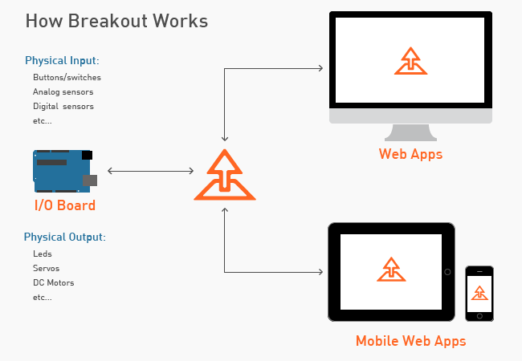

# Firmata Protocol Documentation

Firmata is a protocol for communicating with microcontrollers from software on a computer (or smartphone/tablet, etc). The protocol can be implemented in firmware on any microcontroller architecture as well as software on any computer software package (see list of client libraries below).       
Firmata是与微控制器进行通信的协议，这些微控制器是来自电脑上（或智能手机/平板电脑等）的软件。该协议可以在任何微控制器架构的固件以及任何计算机软件的软件包来实现（见客户端库的名单如下）。

Firmata is based on the [midi message format](http://www.midi.org/techspecs/midimessages.php) in that commands bytes are 8 bits and data bytes are 7 bits. For example the midi Channel Pressure (Command: 0xD0) message is 2 bytes long, in Firmata the Command 0xD0 is used to enable reporting for a digital port (collection of 8 pins). Both the midi and Firmata versions are 2 bytes long, but the meaning is obviously different. In Firmata, the number of bytes in a message must conform with the corresponding midi message. Midi [System Exclusive](http://www.2writers.com/eddie/tutsysex.htm) (Sysex) messages however, can be any length and are therefore used most prominently throughout the Firmata protocol.          
Firmata是基于[MIDI消息格式]（http://www.midi.org/techspecs/midimessages.php）,MIDI消息的命令字节是8位，数据字节是7位。例如MIDI通道压力（命令：0xD0）消息是2字节长，在Firmata,命令0xD0用于启用用于数字端口（8个管脚集合）的报告。无论是MIDI和Firmata版本都是2个字节长，但含义显然是不同的。在Firmata，一消息字节的数目必须与相应的MIDI消息符合。然而，MIDI [系统专用]（http://www.2writers.com/eddie/tutsysex.htm）（SYSEX）消息，可以是任意长度，因此在Firmata协议中，MIDI消息使用的最多。

This repository contains documentation of the Firmata protocol. The core of the protocol is described in the [protocol.md file](protocol.md) file. Feature-specific documentation is described in individual markdown files ([i2c.md](i2c.md), [stepper.md](stepper.md), [servos.md](servos.md), etc). Files appended with '-proposal' are proposals for new features that have not yet been finalized.        
这个库包含Firmata协议文档。协议的核心在[protocol.md文件（protocol.md）文件中描述。特定功能的文档在单独的markdown文件（[i2c.md（i2c.md），[stepper.md]（stepper.md），[servos.md]（servos.md）等）描述。“-proposal”附加文件是尚未敲定新功能的建议。

The Firmata protocol could theoretically be implemented for any microcontroller platform. Currently however, the most complete implementation is for [Arduino](http://arduino.cc) (including Arduino-compatible microcontrollers). Here are the known Firmata microcontroller platform implementations:      
该Firmata协议理论上可以用于任何单片机平台上实现。然而，目前最完整的实现是[Arduino](http://arduino.cc)的（包括Arduino的兼容微控制器）。下面是已知的Firmata微控制器平台实现：

* [Firmata for Arduino](https://github.com/firmata/arduino)
* [Firmata for Spark.io](https://github.com/firmata/spark)

*Please note: I'm sure there are other implementations. If you know of others, please submit a pull request to update this readme file, or open an issue providing the link to be added to this document.*
*请注意：我敢肯定还有其他的实现。如果你知道别人的，请提交pull请求更新此自述文件，或打开提供的链接被添加到该文件的问题。*

## Firmata client libraries
There are several client libraries. These are libraries that implement the Firmata protocol in order to communicate (from a computer, smartphone or tablet for example) with Firmata firmware running on a microcontroller platform. The following is a list of Firmata client library implementations:            
Firmata客户端库:有几个客户端库。这是实现以（从电脑，智能手机或平板电脑为例）与微控制器平台上运行Firmata固件沟通Firmata协议库。以下是Firmata客户端库实现的列表：

* processing
  * [https://github.com/firmata/processing]
  * [http://funnel.cc]
* python
  * [https://github.com/firmata/pyduino]
  * [https://github.com/lupeke/python-firmata]
  * [https://github.com/tino/pyFirmata]
  * [https://github.com/MrYsLab/PyMata]
  * [https://github.com/MrYsLab/pymata-aio]
* perl
  * [https://github.com/ntruchsess/perl-firmata]
  * [https://github.com/rcaputo/rx-firmata]
* ruby
  * [https://github.com/hardbap/firmata]
  * [https://github.com/PlasticLizard/rufinol]
  * [http://funnel.cc]
* clojure
  * [https://github.com/nakkaya/clodiuno]
  * [https://github.com/peterschwarz/clj-firmata]
* javascript
  * [https://github.com/jgautier/firmata]
  * [http://breakoutjs.com]
  * [https://github.com/rwldrn/johnny-five]
* java
  * [https://github.com/4ntoine/Firmata]
  * [https://github.com/kurbatov/firmata4j]
  * [https://github.com/reapzor/FiloFirmata]
* .NET
  * [https://github.com/SolidSoils/Arduino]
  * [http://www.imagitronics.org/projects/firmatanet/]
* Flash/AS3
  * [http://funnel.cc]
  * [http://code.google.com/p/as3glue/]
* PHP
  * [https://bitbucket.org/ThomasWeinert/carica-firmata]
  * [https://github.com/oasynnoum/phpmake_firmata]
* Haskell
  * [http://hackage.haskell.org/package/hArduino]
* iOS
  * [https://github.com/jacobrosenthal/iosfirmata]
* Dart
  * [https://github.com/nfrancois/firmata]
* Max/MSP
  * [http://www.maxuino.org/]
* Elixir
  * [https://github.com/kfatehi/firmata]
* Modelica
  * [https://www.wolfram.com/system-modeler/libraries/model-plug/]
* golang
  * [https://github.com/kraman/go-firmata] 
* Qt/QML
  * [https://github.com/callaa/qfirmata]

*Each client library may not support the most recent version of the Firmata protocol and all features described in this reposity.*
*每个客户端库可能不支持Firmata协议的和最新的版本在此reposity中描述的所有功能。*

## Contributing

To submit a proposal for a new feature, create a [markdown](https://help.github.com/articles/github-flavored-markdown/) file for your proposal and append "-proposal" to the filename. Submit a pull request to add the proposal.    
提交一份提案中的新功能，创建一个[markdown](https://help.github.com/articles/github-flavored-markdown/)提交您的建议，并追加“-proposal”的文件名。提交pull请求来添加建议。

To make a change to an existing protocol, submit a pull request with your proposed changes. Be sure to provide any rationale in the pull request description.     
若要更改现有协议，提交pull请求你的修改建议。请务必提供pull要求说明任何理由。

Some hints for drafting a new proposal:   
为了起草一个新的建议的一些提示：

* If your proposal is sysex-based (it likely will be), try to limit the COMMAND byte (2nd byte in the sysex message) to a single value. Use sub-commands (3rd byte) as necessary if you have more than one message. See the [stepper.md](stepper.md) file for an example. Note the use of `0x72` for the COMMAND and how each section has a unique subcommand (0x00 = config, 0x01 = step).
* 如果您的建议是专用信息为基础的（很可能会），尽量限制命令字节（在SysEx信息第2个字节），以单个值。使用子命令（3字节）作为必要的，如果你有一个以上的消息。见一个例子[stepper.md](stepper.md)文件。注意：该命令的使用0x72`的`以及每个部分都有一个唯一的子命令（0×00=配置，0×01=步骤）。

* The range of values of the COMMAND is any avaliable byte in the range of 0x10 - 0x7F. See the Sysex Message Format section of the [protocol.md](protocol.md) document for the currently used COMMAND values (you may not use any of these values).
* 该命令的值的范围是在0×10范围内的任何avaliable字节-0x7F的。请参阅[protocol.md](protocol.md)文件的SysEx信息格式部分当前使用的指令值（您可能无法使用其中的任何值）。   

* It's okay to have optional values in a sysex message as long as those values are all at the end of the message. See the bytes 10 - 13 of the Stepper step message in [stepper.md](stepper.md)
* 没关系有可选值在SysEx信息，只要这些值都在邮件的末尾。请参阅字节10 - 步进一步的消息在[stepper.md](stepper.md)13

* Try to keep your sysex messages as short as possible。
* 尽量保持你的系统专用信息尽可能短。

* Pack bits if necessary. See the Response message for **Report encoder's position** in [encoder.md](encoder.md) for an example (also note how this was documented following the response message... please include similar documentation if you use bit packing in your proposal).
* 如有必要，包位。见**报告编码器的位置**在[encoder.md](encoder.md)的响应消息的例子（也注意到这是如何记录下响应消息......请包括类似文件，如果您使用的打包的你的建议）。

* If your proposal uses any of the available non-sysex midi messages, the number of bytes in the message must correspond to the number of bytes in the midi message. The meaning however does not need to be the same. However if the midi message is part of a range of values (such as Note Off (0x80)) then the Firmata message must also be a range (such as a range of pins).
* 如果你的提议使用任何可用的非系统专用信息的MIDI消息，字节的消息中的数量必须对应于MIDI消息中的字节数。含义然而并不需要是相同的。然而，如果MIDI消息是值的范围的一部分（如注关（0x80的）），则Firmata消息还必须是一个范围（例如，一个范围销）。
